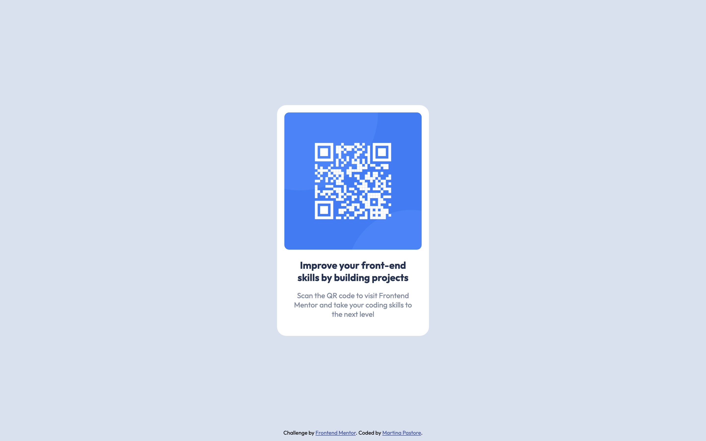

# Frontend Mentor - QR code component solution

This is a solution to the [QR code component challenge on Frontend Mentor](https://www.frontendmentor.io/challenges/qr-code-component-iux_sIO_H). Frontend Mentor challenges help you improve your coding skills by building realistic projects. 

## Table of contents

- [Overview](#overview)
  - [Screenshot](#screenshot)
  - [Links](#links)
- [My process](#my-process)
  - [Built with](#built-with)
  - [What I learned](#what-i-learned)
  - [Continued development](#continued-development)
  - [Useful resources](#useful-resources)

## Overview

### Screenshot

### Links

- Live Site URL: [https://pastoremartina.github.io/QRcodeChallenge/](https://pastoremartina.github.io/QRcodeChallenge/)

## My process

### Built with

- Semantic HTML5 markup
- Simple CSS!

### What I learned

This was a rather basic challenge, so it was perfect for my basic knowledge of CSS. The biggest challenge was to center the card vertically as well as horizontally. 

I learned about ARIA roles and their importance for accessibility.

### Continued development

I'd like to better understand how to use the different layout models (Flexbox and CSS Grid).
I'd also like to try a pre-processor (Sass or maybe Less).

### Useful resources

- [Resource on centering](https://www.freecodecamp.org/news/css-vertical-align-how-to-center-a-div-text-or-an-image-example-code/) - This article really helped me centering the card with CSS positioning, but it shows other methods as well (using Flexbox or CSS Grid).
- [Resource on px vs ems/rems](https://www.joshwcomeau.com/css/surprising-truth-about-pixels-and-accessibility/) - Interesting read about pixels, ems/rems, and accessibility. I will try to implement its concepts in the future.
- [Resource on ARIA roles](https://developer.mozilla.org/en-US/docs/Web/Accessibility/ARIA/Roles) - Comprehensive resource about ARIA roles by Mozilla Web Docs.
